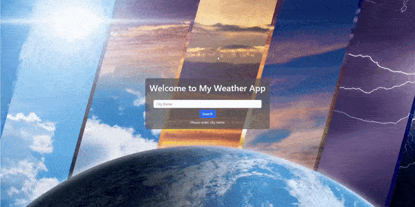
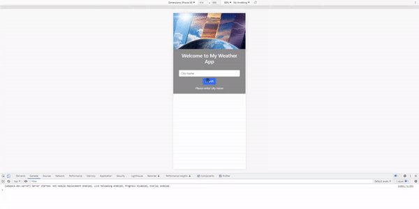

# My Weather APP
In this project dependencies are :
1. axios
1. bootstrap
1. react-bootstrap
1. react-router-dom
1. sweetalert2

## How to use
Type the city name that you want to see the weather forecast for 7 days. Only city and county names are supported.

Please get in contact with me on alihandegirmenciler@gmail.com when you find bugs. Thanks...

## Live Preview
https://alihan-my-weather-app.netlify.app/

### Web

### Mobile
